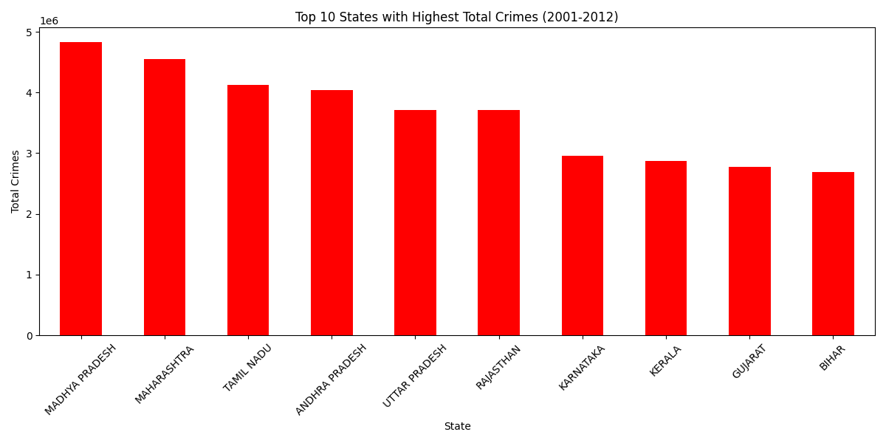
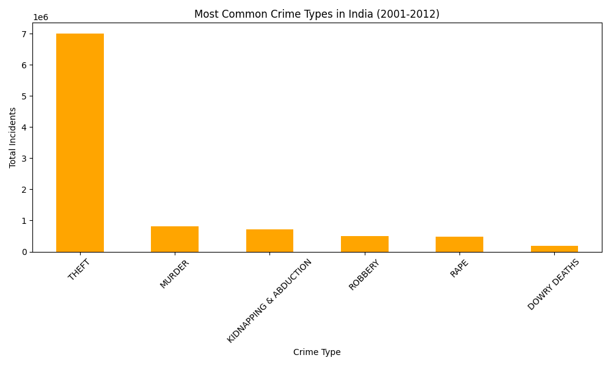

# Crime Data Warehouse — India

Analysis of 9,017 rows of crime data across Indian states from 2001 to 2012.

**By Padma Shree** | Data Science Journey | Project 6 of 25

---

## 📊 Key Findings

| Category | Finding |
|----------|---------|
| **Highest crime state** | Madhya Pradesh (48,27,540 total crimes) |
| **Second highest** | Maharashtra (45,46,872) |
| **Third highest** | Tamil Nadu (41,20,352) |
| **Most common crime** | Theft (70,01,060 incidents) |
| **Second most common** | Murder (8,05,086) |
| **Third most common** | Kidnapping & Abduction (7,13,714) |

---

## 📈 Charts

### Top 10 States by Total Crimes (2001-2012)


### Most Common Crime Types in India


---

## 🛠️ Tech Stack

- Python 3.13
- Pandas (Data loading & analysis)
- Matplotlib (Visualization)

---

## 📂 Dataset

**Source:** Kaggle — Crime in India (NCRB)

**Rows analyzed:** 9,017

**Columns:** 33 crime categories including:
- Murder, Rape, Kidnapping, Robbery, Theft, Dowry Deaths, and more

---

## 🚀 How to Run

```bash
# Clone the repository
git clone https://github.com/Paddu2006/crime-data-warehouse.git

# Install dependencies
pip install pandas matplotlib

# Run the analysis
python crime_analysis.py
